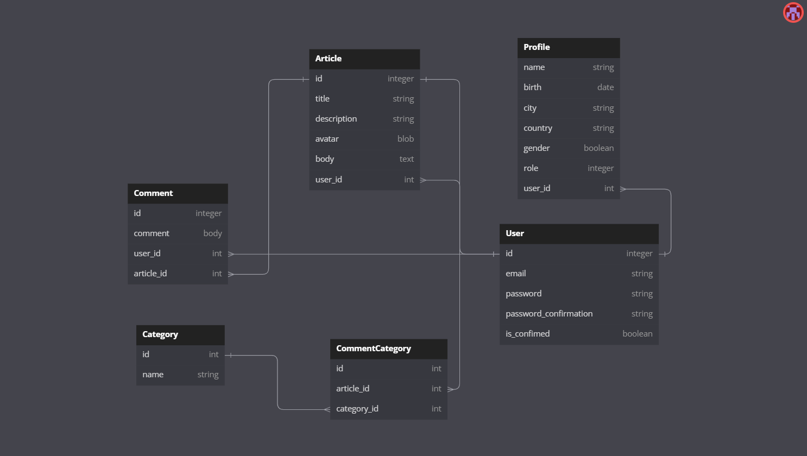

# Omega Blog - Ruby on Rails, Docker and Microsoft Azure.

Esta es la aplicación Omega Blog, donde los usuarios pueden crear artículos y categorías.
También pueden dejar sus propios comentarios e imágenes y archivos sobre cada artículo. Las imágenes y los archivos se guardan usando
Servicios de Microsoft como depósitos.
Puede visitar esta aplicación web haciendo clic en el siguiente a continuación para ver más al respecto.

## Link
En esta sección encontrará un enlace para visitar esta aplicación web.
[https://omega-blog-container.whitegrass-3bec7435.centralus.azurecontainerapps.io/](https://omega-blog-container.nicetree-85345942.australiaeast.azurecontainerapps.io/login)

## 3° Services.

- Microsoft Azure.

Las imágenes y los archivos se guardan dentro de los servicios de Microsoft Azure. Se creó y configuró un depósito para que esto sea posible.
Puede hacer clic en los siguientes enlaces para obtener más información sobre la configuración de Bucket y Active Storage. Además, se ha creado un contenedor acoplable para acceder a esta aplicación. https://azure.microsoft.com/es-es/

## Database diagram.

Este es el diagrama de base de datos donde contiene todas las tablas y atributos implementados en esta aplicación web.

## softwares

- Ruby on Rails 7.
- PostgreSQL.
- Docker.
- Docker Hub.
- Microsoft Azure.
- VS Code.
- TailwindCSS

## Author

- Felipe Carrasco
- felipecarrascolopez@gmail.com
